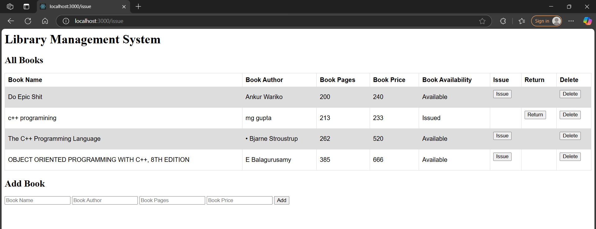

# 📚 Library Management System Using Node.js

> **Last Updated:** 21 Mar, 2025  
> A simple and functional Library Management System built using Node.js, Express.js, and EJS.

## 🧾 Description

A Library Management System is an essential application for managing books, users, and transactions in a library. This project allows administrators to add, update, delete, and view books in a web interface built with EJS templates.

## 🚀 Features

- 📘 Add new books with details (name, author, pages, price, availability)
- 📄 View list of all books
- 🔁 Issue and return books (toggle availability)
- ❌ Delete books from the library
- 🖥 Dynamic UI rendered using EJS templating engine

## 🖼 Project Preview

> _Preview Screenshot or Link (You can add image or demo URL here)_

## 🧠 Project Approach

### 📂 1. Setup Middleware with EJS
- Used EJS as the templating engine to render dynamic HTML pages.
- Configured it in `app.js` using `app.set('view engine', 'ejs')`.

### 🧾 2. Handle Form Data with Body Parser
- Installed and configured `body-parser` middleware to capture and parse form data via POST requests.

### 🛣 3. Routes
- **GET /** → Render home page with book list.
- **POST /** → Add new book.
- **POST /delete/:id** → Delete book by ID.
- **POST /issue/:id** → Mark a book as issued/available.
- **POST /update/:id** → Update book details.

## 🛠 Installation & Setup

### Step 1: Clone the Repository
```bash
git clone https://github.com/Manish1Gupta/library-management-system.git
cd library-management-system

Step 2: Install Dependencies
npm install

Step 3: Run the Application
node app.js

Visit http://localhost:3000 in your browser to view the app.

Project Structure
library-management-system/
├── views/
│   └── home.ejs
├── public/ (Optional for static assets like CSS)
├── app.js
├── package.json


📦 Dependencies
Express
EJS
Body-Parse

✅ Conclusion

This Library Management System allows administrators to:

Add, view, update, delete books

Manage availability (issue/return)

Render data dynamically using EJS

Handle form submissions via Body Parser

It serves as a great starting point for building larger inventory or record-based system


